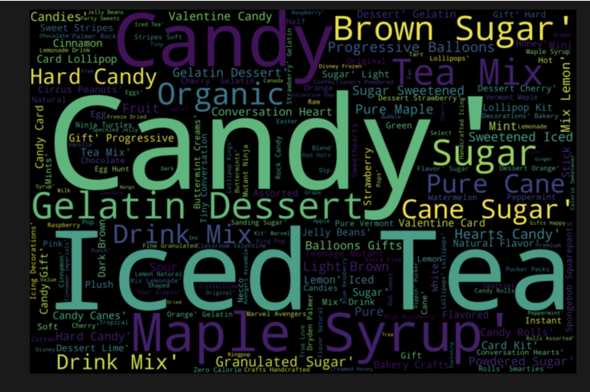
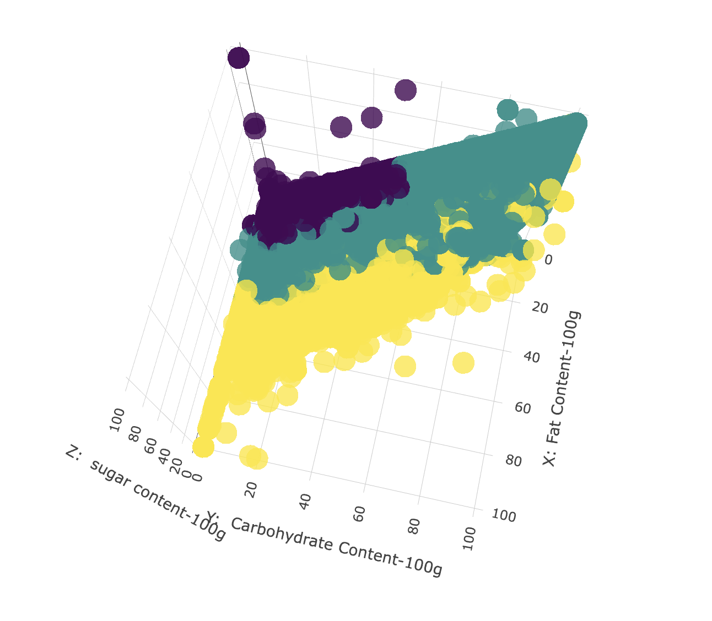

# Unsupervised Machine Learning: Clustering Food Nutrient Pattern
  - One fun fact for ice-tea lovers: in the top 98% percentile of food items ordered by sugar level, "ice-tea" takes up the majority of food description. 

This project analyzed food data with labels and nutrients data to uncover insights from food. It focused on topic modeling, clustering techniques, and visualization techniques to effectively show (NOT tell) the insights: 
  1. [Topic Modeling](https://www.machinelearningplus.com/nlp/topic-modeling-gensim-python/): LDA (Python: Genism, NLTK)
  2. Clustering
  
        a. Model: DBSCAN, KMeans
        
        b. Evaluation: Elbow Visualizer, Silhouette Visualizer
        
  3. Visualization
  
        a. WordMap
        
                                   What Are the Food With the Highest Level of Sugar? 
        
         
 

  

       
        b. 3D Clustering (After PCA)
        
                        Green: Muscle Builder, Yellow: Junk Food, Purple: Best for Diet

        
 

  

        

